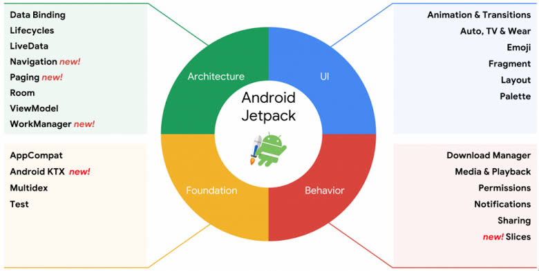

# Movie Catalogue

## Android Jetpack

[Jetpack](https://developer.android.com/jetpack) is a suite of libraries to help developers follow best practices, reduce boilerplate code, and write code that works consistently across Android versions and devices so that developers can focus on the code they care about.

## License

Distributed under the MIT License. See `LICENSE` for more information.

## Contact

Mochammad Arya Salsabila - Aryasalsabila789@gmail.com
